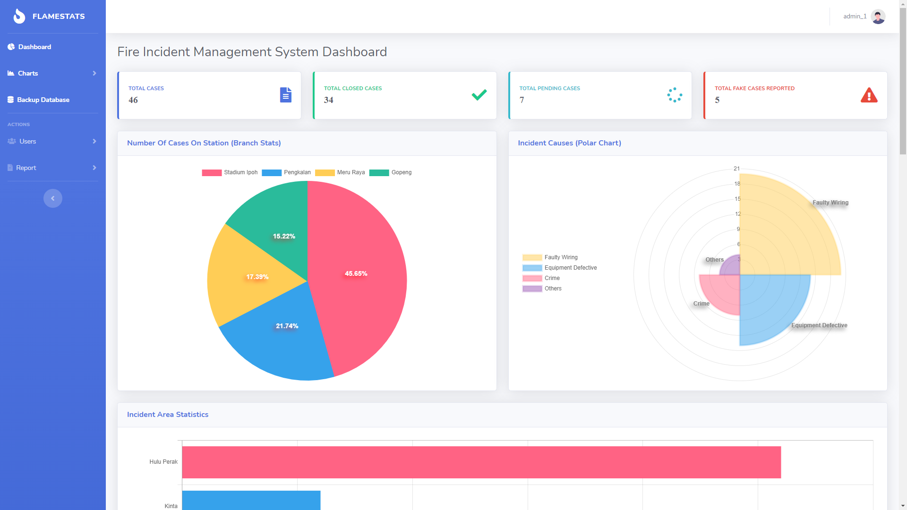

👋 Hi, I’m Shun Kang. I am a final year CS student. I’m interested in Web Development especially Frontend development! 😃 

<h3 align="center">📫 How To Reach Me</h3>

 &nbsp;
  &nbsp;  
 

<h3 align="center">⚙️ My Skills</h3>

 &nbsp;
   &nbsp;
 &nbsp;
 &nbsp;

<h3 align="center">🌱 I’m currently learning</h3>  

<h3 align="center">Projects I have worked on</h3> 
<h2 align="center">Fire Incident Management System</h2>
 
<h4>Project link: http://fms.infinityfreeapp.com/login.php</h4>

Admin  
email: admin@fms.com  
password: admin  

User  
email: user@fms.com  
password: user  

<h5 align="center">Currently working on my portfolio site 😉</h5>

<!---
shunkang129/shunkang129 is a ✨ special ✨ repository because its `README.md` (this file) appears on your GitHub profile.
You can click the Preview link to take a look at your changes.
--->
